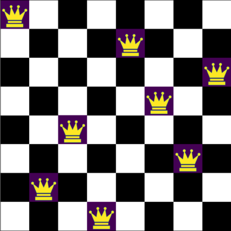
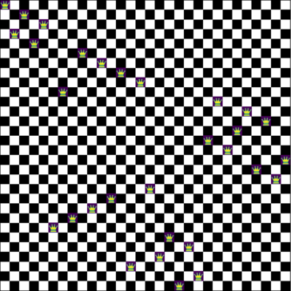

# N-Queens-Puzzle

 ## Placing N non-attacking queens on an N×N chessboard

Here are a solution for $N = 8$ and $N = 30$, respectively.

  
  

 ## This repository includes two main programs. 

The first C++ script is designed to calculate the number of solutions to the N*N Queens puzzle, efficiently handling board sizes up to N = 16 on average. 

| n   | Total Solutions  |
|-----|------------------|
| 1   | 1                |
| 2   | 0                |
| 3   | 0                |
| 4   | 2                |
| 5   | 10               |
| 6   | 4                |
| 7   | 40               |
| 8   | 92               |
| 9   | 352              |
| 10  | 724              |
| 11  | 2,680            |
| 12  | 14,200           |
| 13  | 73,712           |
| 14  | 365,596          |
| 15  | 2,279,184        |
| 16  | 14,772,512       |

The second script, which is written in Python, is used for visualizing only one solution on a chessboard. It calls a C++ script to find the solution. 

Both C++ script implement bit manipulation techniques often referred to as bit operations or bitwise operations.

This method is particularly efficient because it directly manipulates bits to represent states like row, column, and diagonal occupancies, enabling rapid computations and memory efficiency.

